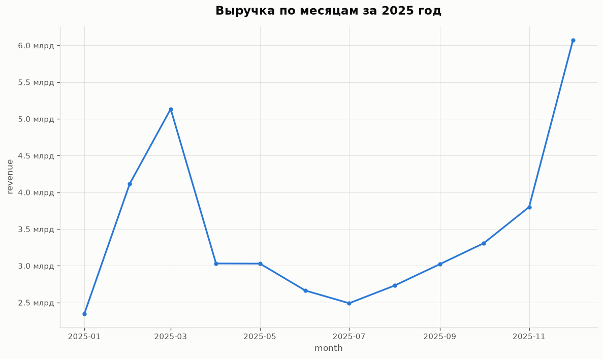
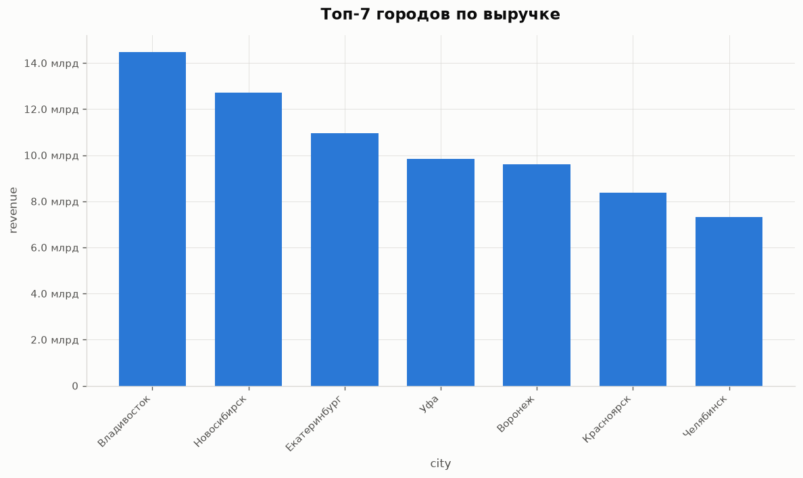

# 💎 Retail AI Assistant

A **fully local, air-gapped-friendly AI analyst** for a retail company. Employees ask
questions in plain Russian — *"выручка по регионам за март"*, *"какие магазины не
выполнили план"*, *"выгрузи продажи в Excel"* — and get a short analytical summary,
a chart (PNG), and/or a formatted Excel export. Everything runs on-premise: LLM via
**Ollama**, data in **ClickHouse**, vector search in **Qdrant**. An optional external
backend (any OpenAI-compatible API, e.g. Groq) can be switched on to benchmark a
stronger model or as an `auto` fallback chain — but the default is 100% local.

**Two interfaces, one core:** a Streamlit desktop chat and a Telegram bot are thin
wrappers around the same `core.ask(question) → AssistantResponse` contract.

## How it works

```
Desktop UI (Streamlit) ─┐        ┌─ Text-to-SQL (schema RAG + few-shot RAG) → ClickHouse
                        ├─ Core ─┼─ Chart builder → matplotlib → PNG
Telegram bot (aiogram) ─┘        ├─ Excel export → openpyxl → xlsx
   thin wrappers over            └─ Summarizer (RU analytical conclusions)
   core.ask(question)
                 Qdrant: retail_schema + retail_few_shot (LaBSE-en-ru, 768d)
                 LLM: Ollama qwen2.5-coder:14b · optional external (Groq) · auto-fallback
```

Per question: **intent routing** (structured JSON: `sql_query` / `sql_with_chart` /
`sql_with_excel` / `chitchat`) → **two-layer RAG** (top-3 relevant table schemas +
top-3 similar question→SQL examples from Qdrant) → **SQL generation** → **validator**
(single SELECT only, forced LIMIT, no system tables) → execute in ClickHouse with
up-to-3 retry-on-error → **artifacts** (chart/Excel as files, so both UIs share one
pipeline) → **2–4 sentence analytical summary** in Russian.

## Example output

Monthly revenue trend (New-Year + Feb/Mar seasonal peaks in the synthetic data)
and a top-cities comparison — real PNG artifacts produced by the chart builder:

| «Покажи график выручки по месяцам» | «Топ-7 городов по выручке» |
|---|---|
|  |  |

## Evaluation

30 natural-language questions with reference SQL (`eval/test_questions.json`),
scored on **execution accuracy** (query runs) and **result accuracy** (result set
matches the reference by denotation — order-invariant, strict on values/shape).
Run: `python eval/run_eval.py`. Same pipeline, two LLM backends:

| Backend | Model | Execution | Result | Avg attempts |
|---|---|---|---|---|
| local (default) | `qwen2.5-coder:14b` (Ollama) | 97% (29/30) | 70% (21/30) | 1.10 |
| external | `llama-3.3-70b-versatile` (Groq) | **100%** (30/30) | **77%** (23/30) | **1.00** |

Full reports with per-category breakdown and failure analysis:
[`eval/results.md`](eval/results.md) (local) ·
[`eval/results_groq.md`](eval/results_groq.md) (external) ·
[`wiki/Evaluation.md`](wiki/Evaluation.md) (methodology + comparison).

## Quick start

```bash
# 0. Services. If you don't run ClickHouse/Qdrant natively:
docker-compose up -d
ollama pull qwen2.5-coder:14b        # Ollama runs on the host

# 1. Python env (3.11+)
python -m venv .venv && source .venv/bin/activate
pip install -r requirements.txt

# 2. Configure
cp .env.example .env                 # set CH_PASSWORD; optionally EXTERNAL_LLM_* / TELEGRAM_*

# 3. Verify all services are reachable
python -m src.check_env

# 4. Generate synthetic data (~1M sales, 2024–2026) → ClickHouse retail_demo
python -m src.data_gen.generate

# 5. Build the Qdrant RAG collections (schema + few-shot)
python -m src.vectorstore.indexer

# 6. Run an interface
streamlit run src/ui_desktop/app.py  # desktop chat → localhost:8501
python -m src.ui_telegram.bot        # telegram bot (token + user whitelist in .env)

# Optional: measure quality
python eval/run_eval.py              # → eval/results.md
```

## The data

Synthetic **jewelry retail chain**: 50 stores, 500 employees, 2,000 products,
**~1M sales** over three full years, monthly revenue plans per store. Generated
with realistic patterns — December + Feb/Mar seasonal peaks, weekend uplift,
per-salesperson skill variance, leader/laggard stores, and a genuine plan-vs-actual
mix (some stores beat plan, some miss). Deterministic (fixed seed), idempotent
(`DROP/CREATE` on rerun). Details: [`wiki/Data.md`](wiki/Data.md).

## Stack & why

| Choice | Rationale |
|---|---|
| **Ollama (local LLM)** | Air-gapped by default — corporate data never leaves the host. |
| **Switchable LLM backend** | `local` / `external` / `auto` (external-first with automatic local fallback on rate limits). Lets one compare model quality (see eval) without changing code; desktop UI has a per-request toggle. |
| **ClickHouse** | Fast analytics over the 1M-row fact table; realistic enterprise dialect for text-to-SQL. |
| **Qdrant + two RAG layers** | Schema RAG grounds SQL in the real tables; few-shot RAG supplies dialect-correct examples nearest to each question — dynamic, not a static prompt. |
| **LaBSE-en-ru embeddings** | Bilingual RU/EN sentence embeddings — questions come in Russian. |
| **File artifacts (PNG/xlsx), not live figures** | The Telegram bot needs files; Streamlit just displays them. One artifact pipeline, two interfaces, core stays interface-agnostic. |
| **No LangChain/LlamaIndex** | The pipeline is explicit on purpose — this is a portfolio project demonstrating the mechanics (routing, RAG, validation, retry, eval). |
| **SQL validator** | Generated SQL is defense-in-depth checked: single `SELECT`/`WITH` only, forced `LIMIT`, system tables & external table functions rejected. |

## Repo map

```
src/core/          orchestrator (intent routing) · sql_generator (RAG + retry) · validator
                   chart_builder · excel_exporter · summarizer · llm_client (3 backends)
src/data_gen/      synthetic data generator (ClickHouse retail_demo)
src/vectorstore/   Qdrant client + indexer (retail_schema, retail_few_shot)
src/prompts/       all LLM prompts as .txt files
src/ui_desktop/    Streamlit chat (charts, Excel download, SQL expander, backend toggle)
src/ui_telegram/   aiogram 3.x bot (whitelist, chart-as-photo, Excel hint)
eval/              30 questions + reference SQL, eval harness, results
tests/             27 unit tests (validator, chart builder, excel exporter)
wiki/              LLM Wiki — the project's compiled knowledge base (start: Index.md)
```

## Project knowledge (LLM Wiki)

This repo is developed with the [LLM Wiki pattern](https://gist.github.com/karpathy/442a6bf555914893e9891c11519de94f):
`raw/` holds immutable source material, `wiki/` is the LLM-maintained compilation —
architecture, decisions, stage log, eval methodology. Start at
[`wiki/Index.md`](wiki/Index.md); contributor rules in [`CLAUDE.md`](CLAUDE.md).
